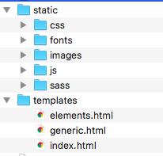

> 说明：为正常显示本文中的数学公式，请使用 Chrome 浏览器并安装 [GitHub with MathJax](https://chrome.google.com/webstore/detail/github-with-mathjax/ioemnmodlmafdkllaclgeombjnmnbima/related) 插件。

# 网络、数据库与网站架设

- Flask
    - 网络基本知识
    - HTML
    - CSS/JavaScript 基础
- MySQL
- Django 介绍

## 第一讲 第一个网页

这个系列的目的在于使用基于 Python 的 Flask 框架制作一个自己的网站。在开始之前，我们首先需要确立的自己的目的。你是为了什么而要做一个网站呢，它与已有的那些网站有什么不同？这些理由可能是：

- 豆瓣不好用，我想自己做一个。
- 我想建立一个自己风格独特的个人网站。
- 我在创业，需要一个网站来宣传自己。
- ……

以上理由中，有一些是很好的理由，有一些不是很好的理由。比如，想做豆瓣的那位同学，请问你是怎么理解豆瓣的呢？如果你只是想建立一个自己整理书影音收藏的目录，那么你的工作量依然是可控的；但是如果你想做一个像豆瓣那样公开的、面向大众参与互动的网站，那么恐怕这件事情的复杂程度远远超过了你的想象。而如果你想做一个自己独特风格的个人网站、一个创业公司的宣传页面，你可能更需要的是学习如何设计网页的外观，将它们运用到现成的各种框架中，如 WordPress。总之，这些都不需要你学习 Python 才能够做；但是，如果你觉得学习 WordPress 的难度甚至高于自己做一个，而你的设计将极为简洁明快，那么，也许你可以尝试一下。

### 学习 Python 能帮你做什么？

网站的“后端”：通俗来说，就是那看不见的部分。它解决“什么页面显示什么内容”的问题。因此它最适合的场景并不是上面这些，而是：

- 为我所在的公司制作一个内部抢月饼的网站
    - <s>趁机可以让老板开除掉一些安全部门的同事</s>
- 评奖申报、活动报名
- 成绩填表整理和产生
- 常用格式文本
- ……

等有特定格式要求和限制的场景。在这些场景中，许多情况缺乏通用的解决方案，或那些方案相对于实际要完成的工作显得过于臃肿而难以理解。在这种情况下，你可以考虑做一个网站，使用 Python 所提供的强大功能。否则，恐怕 WordPress 和各种 CMS 可能更适合你。

### 环境配置

本教程将在很大程度上讲述 Flask 框架的使用。因此，我们有必要首先安装 Flask 包。回忆 [第一部分](1-python.md) 中的相关章节，我们记得，要安装 Flask 可以在命令行中执行下面的命令：

```shell
pip3 install flask
```

在一段时间的等待之后，Flask 应该安装完毕了。这时我们在 Python 中输入

```python
import flask
```

就不应该报任何错误了。


### 第一个页面！

```python
#coding: utf-8
from flask import Flask

app = Flask(__name__)

@app.route('/')
def index():
    return 'My first page!'

if __name__ == '__main__':
    app.debug = True
    app.run()
```

尝试运行这个程序，它并不像之前我们所遇到的那些一样会马上退出。屏幕上会显示：


```
 * Running on http://127.0.0.1:5000/ (Press CTRL+C to quit)
 * Restarting with stat
 * Debugger is active!
 * Debugger pin code: 275-951-055
```

其中，`275-951-055` 这串数字会有所不同。这表明，程序已经开始运行了。

我们在浏览器中打开 http://127.0.0.1:5000/ ，可以看到里面显示了：

```
My first page!
```

这行文字，而这正是我们在 `index` 函数中返回的字符串。

**练习**

用你喜欢的一句话替代这里面的 `My first page!` 这句话。

#### 出现了错误怎么办

有时我们会遇到

```
socket.error: [Errno 48] Address already in use
```

这时，说明我们之前已经运行了一个网站的脚本而没有退出。找到它，将它关闭，然后再尝试一下。

### 发生了什么

我们来一行行看上面这个代码。

```python
#coding: utf-8 <- 这行告诉 Python 解释器用 UTF-8 编码来看待这个文件
from flask import Flask # 从 flask 包中引入 Flask 这个类

app = Flask(__name__) # app 是 Flask 这个类的一个实例。 __name__ 表明当前模块的名称

@app.route('/') # 这是一个装饰器。它告诉 app 也就是我们的网站，下面这个函数，用来处理路径为 '/' 的请求（request）
def index(): # 定义一个叫 index 的函数
    return 'My first page!' # 返回 'My first page!' 这个字符串

if __name__ == '__main__': # 如果我们是在直接运行这个文件
    app.debug = True # 打开调试（debug）模式
    app.run() # 开始运行测试服务器
```

这个解释引出了更多的问题。

- 上面的错误中的 `Address` 指的是什么？
- “路径为 '/' 的请求”一句中的“路径”和“请求”是什么？我那么要强，可从来不求人的啊。

而要说明这些，我们就势必要理解，当我们在浏览器中输入 `http://127.0.0.1:5000/` 并回车（或仅仅只是点击了这个链接时）发生了什么。

就像我们在打电话时需要拨号一样，浏览器需要首先找到服务器“在哪里”。打电话需要一个电话号码，而要找到服务器也需要知道它的网络地址（IP 地址）。电话拨通之后，我们需要语言和对方沟通，比如一个河南人和一个广东人打电话，就没办法讲各自的方言，而要讲他们都学习过的普通话（甚至有时候不得不讲英语）。这种说的话的约定，在浏览器和服务器的通信之中称为**协议**。协议的规定完全是人为的，只需要双方都遵守即可。然后，在这种协议的前提下，双方开始交换信息，比如浏览器告诉服务器“要什么网页”，而服务器告诉浏览器“有没有这个网页”和“这个网页的内容是什么”。如何与服务器通信、服务器的地址，以及我们所需要的是哪个网页，都由 `http://127.0.0.1:5000/` 这串字符确定。习惯上，我们把浏览器发出的信息称为**请求**，而将服务器返回的称为**响应**（response）。

#### HTTP 协议

我们首先来看开头的这个 `http`。`://` 可以看做一个分隔符号。它之前的内容表示了所采用的协议。HTTP 协议是浏览网站时的常用协议，另一种常用的协议则是 HTTPS。

#### IP 地址

`127.0.0.1` 是一个 IP 地址，而且是一个特殊的 IP 地址，它指的就是“本机”。同样，安装配置无线路由器之类的时候，说明书要求输入的 `192.168.1.1` 之类也都是 IP 地址，这种地址用来表示局域网内（比如在无线路由器的例子里，就是连入同一个无线网络）的 IP 地址。学校、公司常用 `10.*.*.*` 这样的 IP 地址，道理也是相同。只有除了这三类以外的 IP 地址，才可能是一个互联网上的 IP 地址。比如，`115.182.201.8` 是豆瓣的一个服务器的 IP 地址。

#### 域名

正如我们打电话的时候可以用通讯录来保存电话号码以避免记忆，我们也用域名来代替 IP 地址。这时，浏览器就额外增加了一个步骤，它与域名解析服务器（DNS）先进行沟通，查询域名对应的 IP 地址，然后再根据查询的结果来向这个 IP 地址的服务器正式进行沟通。要了解域名对应的 IP 地址，可以使用命令行的 `ping` 和 `nslookup` 命令。这两个命令在 Windows 和 Linux/macOS 上都存在。同样，有一个特殊的“域名”叫做 `localhost`，它一定会被解析为 `127.0.0.1`，也就是指向本机。

#### 端口号

`5000` 引入了一个称为**端口号**的概念。引入端口是出于这样的原因：一台服务器，或者一台电脑上，可能运行了许多个网络程序。这样，单单告诉“信息要发给某个地址的服务器”就显得不够了，还要表明这个信息应该让服务器上的哪个程序来处理。端口号就起到这样的作用。对于 HTTP 协议而言，默认的端口号是 80，所以我们访问豆瓣时使用 `http://www.douban.com/` 即可而没有出现这个端口号。实际上，如果我们强行输入 `http://www.douban.com:80/` 也是可以的。对于 HTTPS 协议而言，默认的端口号是 443 。这里的两个数字是由一份称为 [RFC 6335](http://www.iana.org/assignments/service-names-port-numbers/service-names-port-numbers.xhtml) 的文件规定的。IP 地址/域名，和可选的端口号，共同组成了一个“主机名”。比如在我们的例子中，`127.0.0.1:5000` 就是一个主机名。

#### 路径

最后我们看到还有一个孤零零的 `/`。这也就是我们在前面的注释中所看到的那个“路径”。

#### 一点点修改

现在我们再在上面的代码 `index()` 函数定义的下面增加如下代码：

```python
@app.route('/abc')
def abc():
    return 'You requested abc'
```

这时，如果你前面没有退出测试服务器，应该会看到屏幕上又多了两行：

```
 * Detected change in '/Works/cs-humanistic-perspective/web-test.py', reloading
 * Restarting with stat
 * Debugger is active!
 * Debugger pin code: 275-951-055
```

我们这时访问 `http://localhost:5000/abc`，不出所料，浏览器上显示了：

```
You requested abc
```

而我们再将 `abc` 这一段改成如下的样子：

```python
@app.route('/<name>')
def abc(name):
    return 'You requested ' + name
```

在浏览器访问 `http://localhost:5000/test`，浏览器上显示：

```
You requested test
```

这样，我们就知道，不同的路径可以通过不同的函数来进行处理，而多个路径也可以通过参数来由同一个函数处理。

### 让网页复杂一些

现在，我们不满足输出一个简单的字串了。下载本项目中的 [pyhtml.py](pyhtml.py) ，我们将利用它们引入对数据库和 HTML 的介绍。

将 `index` 函数改写成下面的样子：

```python
def index():
    return str(
        HTML(
            HEAD(TITLE("test")),
            BODY(
                [P(
                    "Paragraph %d" % i
                ) for i in range(5)],
                DIV('div element'),
                COMMENT("Some other text"),
                A("index", href="/"),
                IMG(src="https://help.github.com/assets/images/site/be-social.gif")
                )
            )
        )
```

并且别忘了在一开始增加 

```python
from pyhtml import *
```

打开浏览器访问 `http://localhost:5000/`，应该看到下图：


`pyhtml` 是这一部分中为说明 HTML 而写的一个辅助模块。我们在 Chrome 中打开现在的网页，右键点击空白处选择“检查”（Inspect），确保选中了“Elements”选项卡，会看到下图：


这其中所有的内容称之为“网页源代码”，它是用另外一种不同于 Python 的语言，称之为 HTML 语言，写成的。但我们用 `pyhtml` 这个模块，而运用 Python 将它产生了出来。我们把它和上面的这些代码相比较，发现它们同样都有层级的结构，从而构成了我们在[第二部分](2-algo.md)中所说的“树”这种数据结构。每一个 `<>` 括起的都称为一个**标签**。有的标签需要一个和它相对应的闭合标签（`< ... >` 对应于 `</ ... >`），而其中包含了它的子标签（节点）；有的则不需要。但所有这些从根本上仍然只是字符串而已。 有的标签有属性，比如 `a` 标签有一个 `href` 的属性，它的意思是表明这个链接指向何处；比如 `img` 标签有一个 `src` ，表明了要插入的图像的网址。

**练习**

1. 探索 Chrome 的“检查”功能，更改 `index` 函数返回的 HTML 代码，观察它会造成什么结果。
2. 打开你最喜欢的一个网站的首页，使用“检查”功能，依次找到不同内容对应的标签。提示：你可以通过右键点击该节点，选择“Edit as HTML”，来更改它里面的内容。
3. 配合该网页显示的样式，理解若干 HTML 标签的功能和用法，特别是 `a`、`img`、`br`、`b`、`i`、`table`、`div`。尝试用 `pyhtml` 来产生类似的结构。
4. *进阶* 查看 `pyhtml.py`，修改它以增加对新的标签的支持。


## 第二讲 与用户交互

### 一个按钮！

我们继续改写 `index` 函数，把它改成下面的样子：

```python
def index():
    return str(
        HTML(
            HEAD(TITLE("test")),
            BODY(
                FORM(action='/', enctype='multipart/form-data').append(
                    INPUT(type='submit', value='Click!', name='button')
                )
            )
        )
    )
```

这样，刷新 `http://localhost:5000/`，浏览器中便会显示一个按钮。点击它，会发现页面没有变化，但是地址栏中的内容却变成了 `http://localhost:5000/?button=Click%21`。

#### 发生了什么

你提交了一个表单。但是因为 `index` 函数没有处理你点击按钮之后该干啥，所以页面并没有任何变化。

#### 那多出来的一串是什么

`?` 是一个分隔符，它后面的内容相当于是告诉服务器，处理前面一个路径时，要带上的一些参数。现在，我们再度改写 `index`，来看看：

```python
def index():
    if request.args.get('button'):
        return 'You clicked the button!'
    else:        
        return str(
            HTML(
                HEAD(TITLE("test")),
                BODY(
                    FORM(action='/', enctype='multipart/form-data').append(
                        INPUT(type='submit', value='Click!', name='button')
                    )
                )
            )
        )
```

我们刷新 `http://localhost:5000/?button=Click%21`，看到页面中显示了：

```
You clicked the button!
```

而这就是我们想要的。

这个表单，我们是通过在 `body` 标签里面增加了一个 `form` 而实现的。这个 `form` 有两个属性，`action` 表示提交到哪里，也就是哪个路径来处理它提交的内容；`enctype` 表示这些内容如何编码，`multipart/form-data` 是兼容性很好的一种方式，它在将来会允许我们提交文件。

但是这样的提交方式有一种弊病。首先，它让这个网址显得很难看。其次，我们每次刷新都会看到 `You clicked the button`，而只有返回才能回到前面的页面，这不是很好。假设你是在网络购物，这就意味着每次刷新都重新提交了一份新订单，而没有任何提示。这恐怕并不是什么好事。

#### POST 方法

现在，我们在 `form` 标签增加一个属性 `method`，使得相应的那行变成：

```python
                    FORM(action='/', enctype='multipart/form-data', method='POST').append(...)
```

并且把 `if request.args.get('button'):` 处的 `args` 改为 `form`，然后回到 http://localhost:5000/ ，我们再点击这个页面的按钮，会发现页面的内容变成了 `You clicked the button!` 但地址栏中的地址没有变。这时再刷新，浏览器会提示我们：要重新提交表单吗？

**不，可是我明明看到了 Method Not Allowed。**

对……我们还需要告诉 Flask，`index` 函数可以处理 `POST` 方法提交的表单。方法是，修改 `index` 上方的 `@app.route` 修饰符，给它增加一个 `methods` 参数。现在，完整的 `index` 函数如下：

```python
@app.route('/', methods=['GET', 'POST'])
def index():
    if request.form.get('button'):
        return 'You clicked the button!'
    else:        
        return str(
            HTML(
                HEAD(TITLE("test")),
                BODY(
                    FORM(action='/', enctype='multipart/form-data', method='POST').append(
                        INPUT(type='submit', value='Click!', name='button')
                    )
                )
            )
        )
```

现在再试一次，是不是达到了预想的目的？

所以，什么是 `POST` 方法呢？而 `GET` 又是什么呢？

我们上回已经提到，浏览网页时，浏览器和服务器通过 HTTP 协议通信。HTTPS 协议是运行在一种安全机制（SSL）上的 HTTP 协议，因此除却加密解密的部分（我们不会涉及其中原理），它的内部还是一个 HTTP 协议。在我们一开始访问 `http://localhost:5000/` 时，浏览器发送给服务器的请求是这个样子的：

```
GET / HTTP/1.1
Host: localhost:5000
Connection: keep-alive
Cache-Control: max-age=0
Upgrade-Insecure-Requests: 1
User-Agent: Mozilla/5.0 (Macintosh; Intel Mac OS X 10_12_3) AppleWebKit/537.36 (KHTML, like Gecko) Chrome/56.0.2924.87 Safari/537.36
Accept: text/html,application/xhtml+xml,application/xml;q=0.9,image/webp,*/*;q=0.8
Accept-Encoding: gzip, deflate, sdch, br
Accept-Language: zh-CN,zh;q=0.8,zh-TW;q=0.6,en;q=0.4,de;q=0.2,fr;q=0.2,ru;q=0.2
Cookie: csrftoken=HTMGOYkNMA20AaCBpV6LcGelAJXjtZhs
```

顺便一提，这也可以在 Chrome 的 Inspect 所打开的 Developer Tools 窗口中复制到，具体来说，在 Network 选项卡里，刷新页面，会出现一条 `localhost` 的记录。点击它，会看到窗口右边有图形化的各种选项，可以查看 Headers ，而右键点击这个 `localhost` ，选择 Copy -> Copy Request Headers，就能复制到上面的信息。

这里第一行是 `GET / HTTP/1.1`，其中 `HTTP/1.1` 是 HTTP 协议的版本号，`/` 是路径，而 `GET` 就表明说我们的方法或目的是获取这个路径下的信息。后面一行的 `Host` 是前面说过的主机名，之后的 `User-Agent` 给出了浏览器自身的信息，而最后的 `Cookie`，我们将在以后看到它大显身手。

在一开始，我们点击按钮，地址栏随之变成了 `http://localhost/?button=Click%21`，而我们也看到，这串字符也被添加到路径后面，一起发送到了服务器。

```
GET /?button=Click%21 HTTP/1.1
Host: localhost:5000
Connection: keep-alive
Upgrade-Insecure-Requests: 1
User-Agent: Mozilla/5.0 (Macintosh; Intel Mac OS X 10_12_3) AppleWebKit/537.36 (KHTML, like Gecko) Chrome/56.0.2924.87 Safari/537.36
Accept: text/html,application/xhtml+xml,application/xml;q=0.9,image/webp,*/*;q=0.8
Accept-Encoding: gzip, deflate, sdch, br
Accept-Language: zh-CN,zh;q=0.8,zh-TW;q=0.6,en;q=0.4,de;q=0.2,fr;q=0.2,ru;q=0.2
Cookie: csrftoken=HTMGOYkNMA20AaCBpV6LcGelAJXjtZhs
```

而现在，我们在 `form` 的 `method` 中指定 `POST` 之后，当我们点击了按钮，浏览器发送的请求是这个样子的：
 
```
POST / HTTP/1.1
Host: localhost:5000
Connection: keep-alive
Content-Length: 143
Cache-Control: max-age=0
Origin: http://localhost:5000
Upgrade-Insecure-Requests: 1
User-Agent: Mozilla/5.0 (Macintosh; Intel Mac OS X 10_12_3) AppleWebKit/537.36 (KHTML, like Gecko) Chrome/56.0.2924.87 Safari/537.36
Content-Type: multipart/form-data; boundary=----WebKitFormBoundaryiVuBVfNeZJUwElSB
Accept: text/html,application/xhtml+xml,application/xml;q=0.9,image/webp,*/*;q=0.8
Referer: http://localhost:5000/
Accept-Encoding: gzip, deflate, br
Accept-Language: zh-CN,zh;q=0.8,zh-TW;q=0.6,en;q=0.4,de;q=0.2,fr;q=0.2,ru;q=0.2
Cookie: csrftoken=HTMGOYkNMA20AaCBpV6LcGelAJXjtZhs

------WebKitFormBoundaryiVuBVfNeZJUwElSB
Content-Disposition: form-data; name="button"

Click!
------WebKitFormBoundaryiVuBVfNeZJUwElSB--
```

我们看到，第一行中的 `GET` 就已经变成了 `POST`。第二个重要的不同在于它不仅有“头”，而且我们还会看到 Chrome 在图形界面中给出了“Request Payload”（请求体）这个部分，表现在上面的完整信息中，也就是有一个“Content-Length”的字段，并在 Cookie 之后额外还有一部分信息。这部分中自然就保存了我们点击按钮所提交的信息。

#### name 与  id

在观察一些网页的时候，我们会发现，一些 `input` 标签不仅有 `name` 而且也有 `id` 属性。这里需要说明的是，提交而对服务器可见的是 `name` 属性的信息（如上所示：`name="button"`），而 `id` 则是对客户端（浏览器上运行的）脚本可见，相对于使用 `name` 属性访问，客户端脚本使用 `id` 更方便些。我们可以试一试，为 `input` 增加一个 `id` 属性，比如：

```python
                        INPUT(type='submit', value='Click!', name='button', id="something")
```

可以看到，最后提交的请求中，请求体中仍然是上面这些内容。

### 实现一点功能

可是，我们现在所做的这些并没有什么用。为了让它真正发挥作用，我们需要考虑一下自己到底要做什么。在这个系列接下去的时间里，我们将制作和完善一个管理读书笔记的小网站。

在行动之前，我们需要明确这样一些内容：

- 它涉及到哪些数据、信息？
- 这些数据和信息将以怎样的方式组织/呈现出来？

一则读书笔记应当包括：

- 所关联的书目
- 页码或章节
- 笔记内容
- 笔记的标签

而书目信息又包括：

- 标题
- 作者
- 出版社
- 年份

仔细思考一下，一本书可以有多个笔记，而一个笔记则只有一个对应的书目。笔记和书目都是可以增删、修改的。当然，在一个正式的网站中，还应该允许不同的用户分别管理他们自己的笔记，而书目信息应当以某种方式，只允许某些情况下的修改。这后面的一点我们现在还暂时不考虑。

这样的话，我们就需要两种不同类型的数据，即笔记数据和书目数据。而上面所列出的信息则意味着它们的组成部分，也就组成一张表格。明确了这一点后，我们想到了第一部分中介绍过的 SQLite 数据库。它看起来正好适合保存这样的表格。我们可以做一张书目信息的表格和一张读书笔记的表格。

#### 数据库访问

下载本项目中的 [dao.py](dao.py)。DAO 的意思是 Data Access Object，它帮助我们封装了数据库访问所需要用到的代码，使我们可以暂时不必关心数据库是怎么创建和组织的。现在，就让我们先来定义这两个类别。

```python
from dao import DBObject

class Book(DBObject):
    title = ''
    author = ''
    publisher = ''
    year = 2000
    
class Annotation(DBObject):
    book = ''
    page = 0
    chapter = ''
    content = ''
    tag = ' '
```

按照 `dao.py` 中的定义，我们可以通过上述实质上定义静态成员的方式来定义一个表格中的字段。此外，`DBObject` 还默认为我们定义了两个额外的字段 `created_at` 和 `id`。对于我们所定义的字段，可以按照下面的方式来读取或设置：

```python
b = Book(title='Test Book', author='Test Author', publisher='Publisher', year=2010)
b.set("title", "Test1") # 将 title 字段设为 'Test1'
b.get("title", "") # 返回 "Test1"
b.get("abc", "") # 返回 ""
```

那么，我们就来创建一个添加书目的表单吧。

```python
@app.route('/add-book', methods=['GET'])
def add_book_form():
    return str(
        HTML(
            HEAD(TITLE("添加一本书")),
            BODY(
                FORM(action='/add-book', enctype='multipart/form-data', method='POST').append(
                    TABLE(
                        [TR(TD(tip), TD(INPUT(type='text', name=name))) for tip, name in zip(['标题', '作者', '年份', '出版社'], ['title', 'author', 'year', 'publisher'])]
                    ),
                    INPUT(type='submit', value='提交')
                )
            )
        )
    )
```

现在，让我们访问 `http://localhost:5000/add-book`，应该出现这样一个表单：


然后，我们同样还需要增加一些代码，来处理书目，即 `add_book_deal` 。完整的代码如下：

```python    
@app.route('/add-book', methods=['POST'])
def add_book_deal():
    b = Book()
    for _ in request.form:
        b.set(_, request.form[_])
    b.save()
    return '添加成功！'
```

现在，我们能够把书目信息顺利提交了。提交完了之后我们会想要看到它的结果，这时应该怎么办呢？就让它显示在首页上吧！我们来重新写一下 `index` 函数：

```python
@app.route('/')
def index():
    return str(
        HTML(
            HEAD(TITLE("书目笔记")),
            BODY(
                H1("书目列表"),
                HR(),
                A("添加书目", href=url_for('add_book_form')),
                UL([
                    LI(A(_.get('title'), href=''), _.get('author'), _.get('publisher'), _.get('year')) for _ in Book().select()
                ])
            )
        )
    )
```

注意到这里我们添加了一个连接，它指向我们刚才的 `add-book`。不过我们在此却并不直接用这个路径，而用 Flask 提供的 `url_for` 函数，提供了函数的名称。（记得使用前要 `import` 哦！）这就方便日后出于某些原因修改路径了。

现在让我们回到首页，看看刚才的有没有添加上：


看来，是真的添加上了。最后，让我们看一下目前这个网站的全部代码：

```python
#!/usr/local/bin/python3

#coding: utf-8
from flask import Flask
from flask import request, url_for
from pyhtml import *

app = Flask(__name__)

from dao import DBObject

class Book(DBObject):
    title = ''
    author = ''
    publisher = ''
    year = 2000
    
class Annotation(DBObject):
    book = ''
    page = 0
    chapter = ''
    content = ''
    tag = ' '

@app.route('/')
def index():
    return str(
        HTML(
            HEAD(TITLE("书目笔记")),
            BODY(
                H1("书目列表"),
                HR(),
                A("添加书目", href=url_for('add_book_form')),
                UL([
                    LI(A(_.get('title'), href=''), _.get('author'), _.get('publisher'), _.get('year')) for _ in Book().select()
                ])
            )
        )
    )
    
@app.route('/add-book', methods=['GET'])
def add_book_form():
    return str(
        HTML(
            HEAD(TITLE("添加一本书")),
            BODY(
                FORM(action='/add-book', enctype='multipart/form-data', method='POST').append(
                    TABLE(
                        [TR(TD(tip), TD(INPUT(type='text', name=name))) for tip, name in zip(['标题', '作者', '年份', '出版社'], ['title', 'author', 'year', 'publisher'])]
                    ),
                    INPUT(type='submit', value='提交')
                )
            )
        )
    )
    
@app.route('/add-book', methods=['POST'])
def add_book_deal():
    b = Book()
    for _ in request.form:
        b.set(_, request.form[_])
    b.save()
    return '添加成功！'

if __name__ == '__main__':
    app.debug = True
    app.run()
```


**练习**

编写表单生成和处理函数，以依照上面定义的 `Annotation` 来添加笔记。使显示书目标题的链接指向笔记列表页面，而在笔记列表页面中则同样显示一个新增笔记的链接。
以下代码片段供参考：

```python
A(_.get('title'), href=url_for('add_annotation_form', book_id=_.id)) # 这将产生出一个链接，指向新增笔记的表单页面。
    
@app.route('/add-annotation/<book_id>', methods=['GET'])
def add_annotation_form(book_id):
    b = Book().select(id=book_id)[0]
    return str(
        HTML(
            HEAD(TITLE("添加读书笔记")),
            BODY(
                H1(b.get('title')),
                FORM(action='', enctype='multipart/form-data', method='POST').append(
                    TABLE(
                        # TODO：在这里填上你的代码
                    ),
                    INPUT(type='submit', value='提交')
                )
            )
        )
    )
    
@app.route('/add-annotation/<book_id>', methods=['POST'])
def add_annotation_deal(book_id):
    # TODO：在此填上你的代码
    return '添加成功！'
    
```

## 第三讲 做得好看一点

好看，是一种口味问题。比如，我觉得现在这样子，很朴素，也算好看。但是……毕竟并不是所有的场合都适合这种朴素。我们还是希望它做得更“现代”一些。

至此我们碰到了一些 HTML 标签，但我们还是处于用 Python 语言来描述的状态，而没有直面它们本身。这就使我们错过了许多借鉴学习的机会。

### Flask 的模板

我们再回过头来看前两次网页之路中的内容。我们用一个 pyhtml.py 提供的类来用 Python 语言描述了网页的结构：最外面是 `<html>` 标签，然后有 `<head>` 和 `<body>`，`<head>` 中又有 `<title>` 决定了标题，而 `<body>` 中的 `<div>`、`<p>`、`` 等等各司其职，组成了网页中的元素。

但问题是，这并不是一种通行的方法。我们依赖 Python 来产生 HTML 代码，这就不能使负责“网页上怎样呈现”的代码与“网页上呈现什么”的代码分开来，而这将不利于我们维护代码，也不利于几个人分工合作来完成同一个网站。

将这二者分开，Flask 框架提供了一个办法，叫做 `template` 模板。假设我们是在 `~/Works/cs-humanistic-perspective` 这个文件夹里工作，我们创建一个文件夹，取名叫 `templates`。然后，让我们在 `templates` 里建立一个文件，叫做 `index.html` 。 接下来，我们修改原来的 `index` 函数：

```python
@app.route('/')
def index():
    return render_template('index.html', books=Book().select())
```

别忘了要在 `from Flask import ...` 最后加上这个 `render_template`。

接下来，我们来编辑这个 `index.html`。

```html
<html>
<head>
	<title>书目笔记</title>
</head>
<body>
	<h1>书目列表</h1>
	<hr/>
	<a href="{{ url_for('add_book_form') }}">添加书目</a>
	<ul>
		
		<li><a href="{{ url_for('list_annotations', book_id=_.id) }}">{{ _.get('title') }}</a> {{ _.get('author') }} {{ _.get('publisher') }}  {{ _.get('year')}} <a href="{{ url_for('add_annotation_form', book_id=_.id) }}">+</a></li>
		
	</ul>
</body>
</html>
```

运行，我们发现，首页完全没什么变化嘛！这就对了。我们已经成功地将网页里要显示的数据内容，和排列这些数据的方式分离开来。

#### 发生了什么

我们建立了一个模板，并在 Python 中让 Flask 来用它产生网页代码。

我们的模板用到了一个变量叫 `books`，也就是 `` 中用到的，而它的值则在 Python 代码中调用 `render_template` 时通过关键字参数的方式给定了。在 Flask 的模板中，语法和 Python 有点相像，但其实它们可以说是完全不同的。注意到它并不以 `:` 结尾，而且下面还有一个对应的 ``。 `{{ }}` 括起的部分，其表达式的值会出现在显示出来的网页上；而 `` 括起的部分，可以称为控制语句，它们控制一些部分的代码怎样显示出来。除了 `for` 之外，常用的还有 `if` 等。

而作为模板的网页是用 HTML 代码写成的。可是我们还不怎么会写 HTML，怎么办？网页教程也是千千万，我个人认为 w3schools（https://www.w3schools.com/；中文版 http://www.w3school.com.cn/）就很好。不过更方便的一种手段，也许就是从别人的基础上做起。[HTML5 UP!](https://html5up.net/) 是一个提供免费网页模板的网站。大致上说，我们只要选择一个比较合适（好看）的代码下载下来，然后用 Flask 的模板功能填充进合适的内容就可以了。

### 网页路径和静态文件

我们已经对网页的路径略有了解。现在我们来看 HTML 中如何表示某个路径的。我们就只看最简单的 `<a href="...">` 标签。`...` 的部分通常有如下几种写法：
	
- `http://github.com/`：无论这个网页本身的路径是什么，这个路径都表示，这个连接只会指向 `http://github.com/` 这个网址。有着完整的协议名称、主机名和（可选的）路径的网址称为绝对路径。
- `//github.com/zhuth`：如果这个网页本身是以 HTTP 协议提供的，那么它就指向 `http://github.com/zhuth`；如果是以 HTTPS 协议提供的，那么它就指向 `https://github.com/zhuth`。
- `/zhuth`：`/` 开头的路径也是一种绝对路径，它表示，无论当前网页的具体路径是什么，它都会取代者其中的路径部分。比如，如果我们是在 `http://example.com/abcdefg/hijklmn` 上出现了这个网页，它就指向 `http://example.com/zhuth`；而如果是在 `https://github.com/some/other/path` 上出现的，它就指向 `https://github.com/zhuth`。它是一种很常用的形式，因为我们往往也不是很有必要确定自己做的网页的具体域名之类是什么。
- `zhuth`：这是一种相对路径，它根据当前网页的位置来决定。比如，当前网页的网址是 `http://example.com/some/page`，它就指向 `http://example.com/some/zhuth`；如果是 `http://example.com/some/page/`，它就指向 `http://example.com/some/page/zhuth`。注意末尾这一个小小的 `/`！它就有很大的不同。我们在用 Flask 做网页时，很少采用这种形式。
- `../zhuth`：这是一种相对路径，其中 `../` 表示“当前位置的上一级目录”，比如 `http://example.com/some/page/1` 的 `../` 就是 `http://example.com/some/`。类似的还有 `./` 表示“当前位置所在的目录”，通常可以省略掉，因此 `./zhuth` 和 `zhuth` 的效果是一样的。`../` 还可以连用，形成诸如 `../../../zhuth`。特别地，如果 `../` 的数量超过当前位置所在的实际目录层数，它和 `/` 在效果上是一样的。

可以看出，对于网站来说，使用绝对路径会比较好一些。而这也是考虑到我们用 Flask 做的网站本身往往占据了一个单独的主机名，如 `localhost:5000`。但最好的方式仍然是像我们在 `index.html` 中所做的那样，用 `{{ url_for(...) }}` 函数。

特别地，`url_for` 接受一个特殊的字串作为第一个参数，也就是 `url_for('static', filename='style.css')` 这样的形式。它表示静态文件夹 `static/` 中的某个文件。因此我们首先还是要在 Python 代码所在的文件夹里新建一个文件夹，叫做 `static` （这是规定！）。所谓静态文件，就是不因用户的访问、数据的变化而变化的那部份文件。

我们从 HTML5UP! 上下载 Phantom 这个模板：https://html5up.net/phantom/download ，解压缩，得到下面这些文件（夹）：

```
LICENSE.txt   assets        generic.html  index.html
README.txt    elements.html images
```

现在，我们把 `images` 这个文件夹和 `assets` **下面的**文件夹（`css` 、`fonts`、`js` 等）都移动到我们刚刚建立的这个 `static` 文件夹里，把 `generic.html`、`index.html`、`elements.html` 这三个文件移动到 `templates` 文件夹里（覆盖掉我们刚才写的 `index.html`，然后重新来过）。这样，我们的工作文件夹的结构如下：



重新打开 `templates/index.html`，我们来看看它里面有什么：

```html
<!DOCTYPE HTML>
<!--
	Phantom by HTML5 UP
	html5up.net | @ajlkn
	Free for personal and commercial use under the CCA 3.0 license (html5up.net/license)
-->
<html>
	<head>
		<title>Phantom by HTML5 UP</title>
		<meta charset="utf-8" />
		<meta name="viewport" content="width=device-width, initial-scale=1" />
		<!--[if lte IE 8]><script src="assets/js/ie/html5shiv.js"></script><![endif]-->
		<link rel="stylesheet" href="assets/css/main.css" />
		<!--[if lte IE 9]><link rel="stylesheet" href="assets/css/ie9.css" /><![endif]-->
		<!--[if lte IE 8]><link rel="stylesheet" href="assets/css/ie8.css" /><![endif]-->
	</head>
	<body>
	...
```

喔，好多东西。不着急，我们先看看，这里面的路径是不是都需要修改了？很不幸，确实是这样。不过，还好我们有──正则表达式！

使用你的编辑器的正则表达式替换功能，搜索 `"assets/(.*?)"`（含双引号），替换成 `"{{ url_for('static', filename='$1') }}"`（含双引号）；再搜索 `"(images/.*?)"`（含双引号），同样替换成 `"{{ url_for('static', filename='$1') }}"`（含双引号）。我们再来重新运行网页代码，打开 `http://localhost:5000/` 看看：

哗，完全不是我们刚才的那个网页了。书目的内容怎么填进去呢？不要着急，我们用 Chrome 的 Inspect Element 功能，来选择一个项目，比如那个 MAGNA 好了：看到 Chrome 提示我们它的位置是在 `#main > div > section > article:nth-child(1) > a`。（这是一个 CSS Selector 的元素位置表示，感兴趣的读者可以参看 w3schools 的相关教程学习。其实很多东西不难猜到，不带任何符号修饰的部分是 HTML 标签的名称，而 `#` 后面的对应于  `name` 属性，`.` 后面的对应于 `class` 属性，等等。）嗯，我们就按图索骥在 HTML 代码里找到这个 MAGNA 元素（和它所在的这一级）：

```html
<section class="tiles">
	<article class="style1">
		<span class="image">
			
		</span>
		<a href="generic.html">
			<h2>Magna</h2>
			<div class="content">
				<p>Sed nisl arcu euismod sit amet nisi lorem etiam dolor veroeros et feugiat.</p>
			</div>
		</a>
	</article>
	<article class="style2">
		<span class="image">
			
```

看到，每一个项目可以拆解成这样一些东西：

- `<article class="style1">`──style 后面的数字从 1 到 6 不等，对应于不同的颜色；
- `<span class="image">`──里面包含了一张图片，我们将来会用到图书的封面图片，所以先不管它；
- `<a href="generic.html">`──这里有个连接，我们就让它指向图书的信息页面好了；
- `<h2>Magna</h2>`──显示的大文字，我们让它显示书目标题；
- `<div class="content">`──里面有鼠标移动上去之后显示出来的文字，我们让它显示书目的信息。
	
好，说干就干，我们删掉其它 `article` 元素，并把第一个用 `` 围起来：

```html

<article class="style{{ loop.index % 6 + 1 }}">
	<span class="image">
		
	</span>
	<a href="{{ url_for('list_annotations', book_id=_.id) }}">
		<h2>{{ _.get('title') }}</h2>
		<div class="content">
			<p>作者：{{ _.get('author') }} 出版社：{{ _.get('publisher') }} 年份：{{ _.get('year')}}</p>
		</div>
	</a>
</article>

```

保存，刷新页面！

**练习**

修改该模板中的页面，并改写相关函数，将我们的书目笔记网站改得漂亮一些。

### 可是为什么这个网页就突然好看了呢

观察现在的 `templates/index.html`，我们没有看到任何有关什么地方用什么颜色、字体、字号的描述。原来，它们都藏进了 `class` 标签和相关的标签名称中，而开头的那一行 `<link rel="stylesheet" href="{{ url_for('static', filename='css/main.css') }}" />` 指定了一个 CSS 文件。我们把它打开来看看里面有什么：

```css
@import url(font-awesome.min.css);
@import url("https://fonts.googleapis.com/css?family=Source+Sans+Pro:300,700,900");

/*
	Phantom by HTML5 UP
	html5up.net | @ajlkn
	Free for personal and commercial use under the CCA 3.0 license (html5up.net/license)
*/

/* Reset */

html, body, div, span, applet, object, iframe, h1, h2, h3, h4, ...{
	margin: 0;
	padding: 0;
	border: 0;
	font-size: 100%;
	font: inherit;
	vertical-align: baseline;
}
	
```

一大堆东西啊……

嗯，不着急，我们并不需要从头开始写。相反，更多专门的 CSS 包都有相关文档，告诉我们要显示什么效果该怎样配合使用 HTML 标签和 `class` 属性。这时候，善用 Chrome 的 Inspect Element 并在右侧修改一些 Style 属性就很重要了。当然，感兴趣的读者还可以进一步求索 w3schools 提供的 CSS 教程，这里就不叙述了。总之，有关网页“看上去怎么样”的定义，大多数时候就有赖于这些 CSS 文件。这样，我们一方面通过 HTML 和 Python 代码分离，实现网页布局与数据内容在服务器这边的分离；又通过 CSS 文件，实现网页内容和显示样式在浏览器（浏览者）那边的分离。这种分离使分工合作成为可能──它本身就是一种分工组织的方式。

